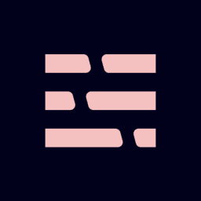
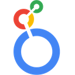

# premojis
Emojis for Prefect

## All Premojis

Premoji | Name | Codes
--- | --- | ---
 | AWS | `:aws:`, `:amazon-web-services:`
 | AWS Lambda | `:lambda:`, `:aws-lambda:`, `:amazon-lambda:`
 | AWS S3 | `:s3:`, `:aws-s3:`, `:amazon-s3:`
 | Airbyte | `:airbyte:`
 | Alert | `:alert:`
 | Azure | `:azure:`, `:microsoft-azure:`
 | dbt | `:dbt:`
 | Fivetran | `:fivetran:`
 | GitHub | `:github:`
 | Google | `:google:`
 | Google Calendar | `:google-calendar:`, `:gcal:`
 | Google Cloud Platform | `:gcp:`, `:google-cloud:`
 | Google Drive | `:google-drive:`, `:gdrive:`
 | Google Maps | `:google-maps:`
 | Hex | `:hex:`
 | Looker | `:looker:`
 | Monte Carlo | `:monte-carlo:`
 | Netlify | `:netlify:`
 | Octocat | `:octocat:`, `:github-octocat:`
 | PagerDuty | `:pagerduty:`
 | Party Parrot | `:party-parrot:`
 | Prefect | `:prefect:`
 | Prefect 2.0 | `:prefect-2:`
 | Prefect Cloud | `:prefect-cloud:`
 | PyTorch | `:pytorch:`
 | Segment | `:segment:`
 | Slack | `:slack:`
 | Snowflake | `:snowflake:`
 | Spark | `:spark:`
 | Streamlit | `:streamlit:`
 | TensorFlow | `:tensorflow:`

